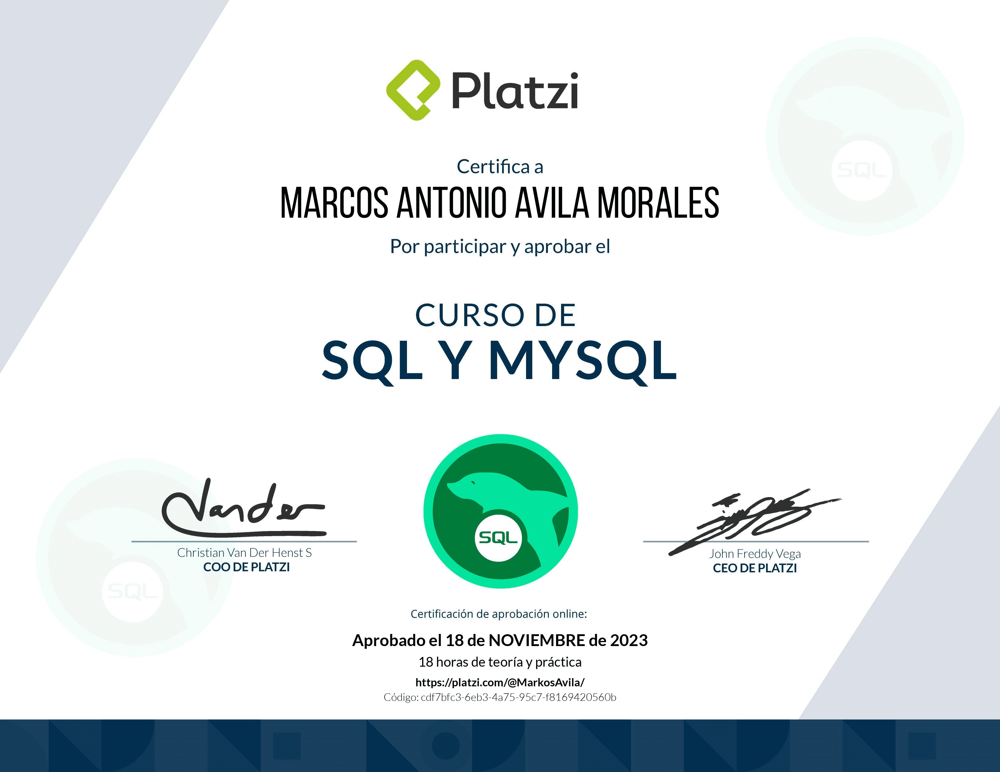
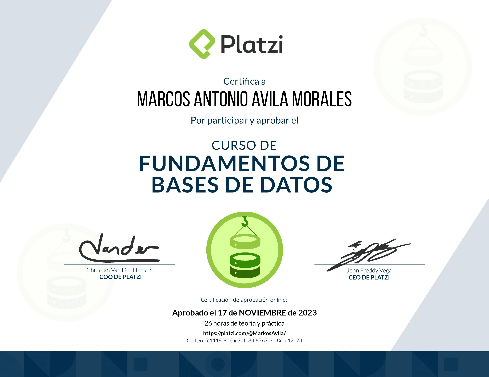
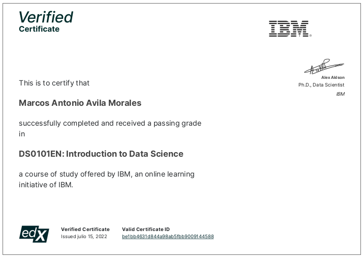
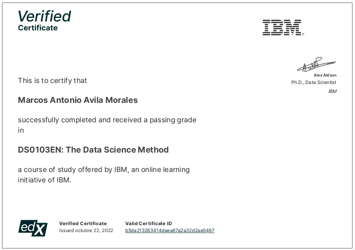

# Hola, soy Marcos Antonio Ávila Morales. 👋

##   Acerca de mi

Me motiva convertirme en un desarrollador experimentado en Python, con habilidades en el análisis y modelado de datos. Me apasiona explorar nuevas áreas y actualmente mi objetivo es desarrollar proyectos personales que me permitan aplicar y perfeccionar mis conocimientos en la resolución de problemas cotidianos en la vida de las personas.

Además, espero unirme a un equipo de trabajo colaborativo que me ofrezca oportunidades de crecimiento y me permita aportar valor. Me gusta el trabajo en equipo y pasar tiempo con personas que comparten mis intereses.

Actualmente, lo que más me gusta en mi tiempo libre es estar en contacto con la naturaleza, ya que me ayuda a conseguir tranquilidad.

##   Proyectos destacados
- **DashBio:** Aplicación para llevar un control de parámetros como la glucemia y la tensión arterial [[1](URL_de_repositorio_1)]. (En desarrollo)

## 🥇Skills

<ul>
 <li>✅ HTML5</li>
 <li>✅ CSS3</li>
 <li>✅ JavaScript</li>
 <li>✅ React</li>
 <li>✅ Astro</li>
 <li>✅ Tailwind</li>
 <li>✅ Python</li>
 <li>✅ FastAPI</li>
 <li>✅ SqlAlchemy</li>
 <li>✅ Git</li>
 <li>✅ GitHub</li>
 <li>✅ ApiRest</li>
 <li>✅ SQL</li>
 <li>✅ MySQL</li>
 <li>✅ PostgreSQL</li>
 <li>✅ Mongodb</li>
 <li>✅ Linux</li>
</ul>

  
 
 
 
 
 
 
 
 
 
 
 
 
 
 
 
 
 
 

## 👀 Intereses

<ul>
<li>✅ Statistics</li>
<li>✅ Data analysis</li>
<li>✅ Data science</li>
<li>✅ Machine Learning</li>
<li>✅ Deep Learning</li>
<li>✅ Artificial Intelligence</li>
<li>✅ Trading algorithms</li>
</ul>

## 🗣 Idiomas
Spanish (native)

English (B1)

## 🎓 Estudios

🎓 Carrera de Medicina (abandonada en 5º curso).

🎓 Actualmente estudio la Licenciatura en Ingeniería en Sistemas Computacionales. Modalidad en línea en la Universidad Virtual del Estado de Guanajuato (UVEG).

## 🏁 Proyección para el año 2024
Para este año 2024 tengo 3 objetivos principales:

<ul class="text">
<li>Desarrollar proyectos.</li>
<li>Incursionar en machine learning, deep learning e inteligencia artificial.</li>
<li>Unirme a un equipo que promueva mi crecimiento profesional.</li>
</ul>

## 🤙 Contacto

 [LinkedIn](https://www.linkedin.com/inmarcos-antonio-avila-morales/)

[+53 55417357](https://wa.me/5355417357) 🇨🇺

@markospy

[marco.developer@outlook.com](mailto:marco.developer@outlook.com)

Colaboremos en apasionantes proyectos de Python.

## 🏆 Algunos pequeños logros

 
 
 
 
 
 
 
 
 
 
 
 
 
 
 

