# Hi, I'm Marcos Antonio Avila Morales! 👋

##   About Me

I am motivated to become an experienced Python developer, with skills in data analysis and modeling. I love exploring new areas and currently my goal is to develop personal projects that allow me to apply and perfect my knowledge in solving everyday problems in people's lives.

Additionally, I hope to join a collaborative work team that provides me with opportunities for growth and allows me to add value. I am passionate about teamwork and spending time with people who share my interests.

Currently, what I enjoy most in my free time is being in contact with nature, as it helps me achieve peace of mind.

##   Featured Projects
- **DashBio:** Application to keep track of parameters such as blood glucose and blood pressure [[1](URL_of_repository_1)]. (In development)

## 🥇Skills

<ul>
<li>✅ Python</li>
<li>✅ FastAPI</li>
<li>✅ SqlAlchemy</li>
<li>✅ Numpy</li>
<li>✅ Pandas</li>
<li>✅ Polars</li>
<li>✅ Matplotlib</li>
<li>✅ Selenium</li>
<li>✅ BeautifulSoup</li>
<li>✅ Nicegui</li>
<li>✅ Git</li>
<li>✅ GitHub</li>
<li>✅ MQL5</li>
<li>✅ Docker</li>
<li>✅ ApiRest</li>
<li>✅ SQL</li>
<li>✅ MySQL</li>
<li>✅ PostgreSQL</li>
<li>✅ SQLite</li>
<li>✅ Mongodb</li>
<li>✅ Linux</li>
</ul>

 
 
 
 
 
 
 
 
 
 
 
 
 
 
 
 
 
 
 
 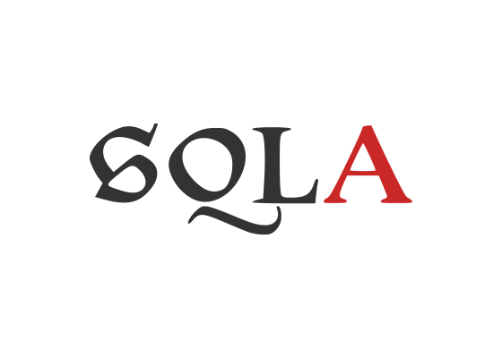
 

## 👀 Interests

<ul>
<li>✅ Statistics</li>
<li>✅ Data analysis</li>
<li>✅ Data science</li>
<li>✅ Machine Learning</li>
<li>✅ Deep Learning</li>
<li>✅ Artificial Intelligence</li>
<li>✅ Trading algorithms</li>
</ul>

## 🗣 Languages
Spanish (native)

English (B1)

## 🎓 Studies

🎓 Medicine career (abandoned in the 5th year).

🎓 I am currently studying a degree in Computer Systems Engineering. Online modality at the Universidad Virtual del Estado de Guanajuato (UVEG).

## 🏁 Projection for the year 2024
For this year 2024 I have 3 main objectives:

<ul class="text">
<li>Develop Data Science projects.</li>
<li>Venture into machine learning, deep learning and artificial intelligence.</li>
<li>Integrate into a work team that promotes my professional growth.</li>
</ul>

## 🤙 Contact

Connect with me on
 

 [LinkedIn](https://www.linkedin.com/inmarcos-antonio-avila-morales-027b34292/)

[+53 55417357](https://wa.me/5355417357) 🇨🇺

@markospy

[marco.developer@outlook.com](mailto:marco.developer@outlook.com)

Let's collaborate on exciting Python projects!

## 🏆 Some small achievements

 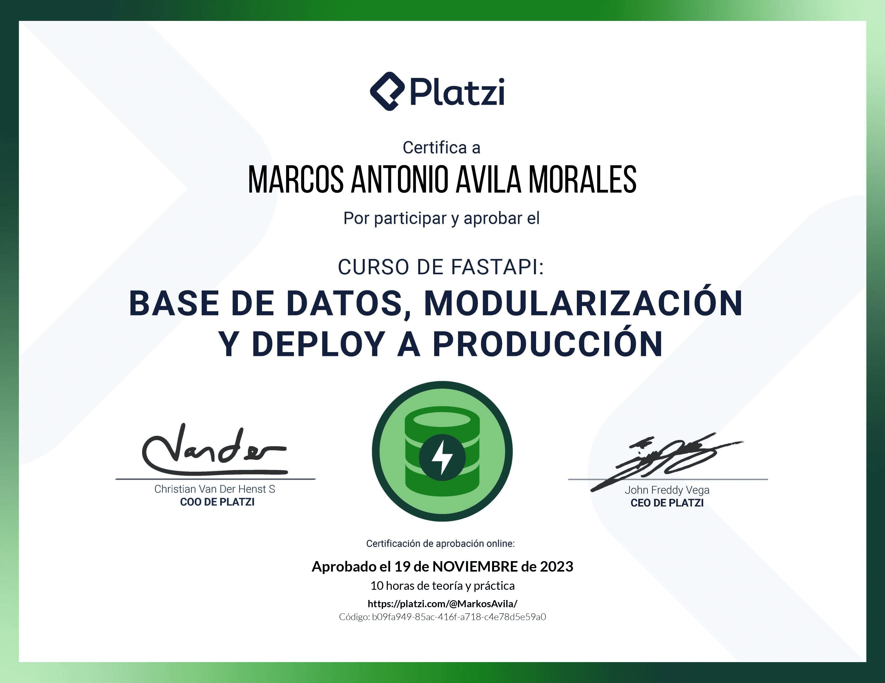
 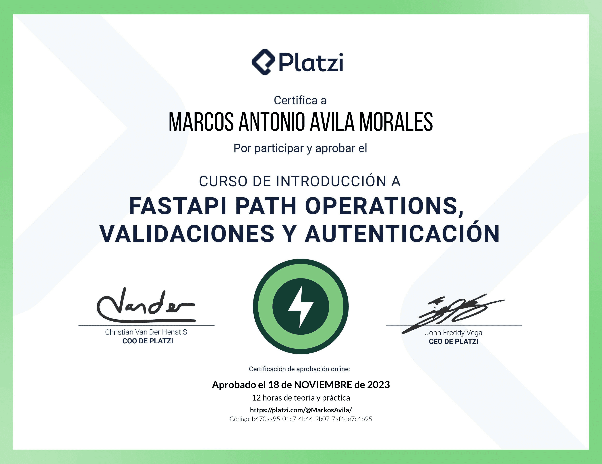
 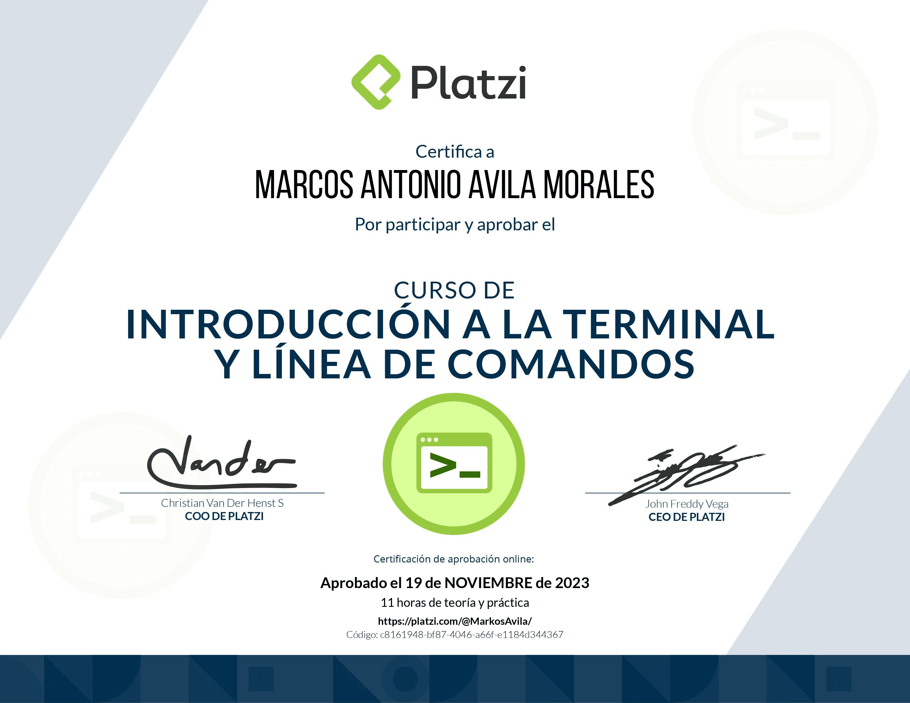
 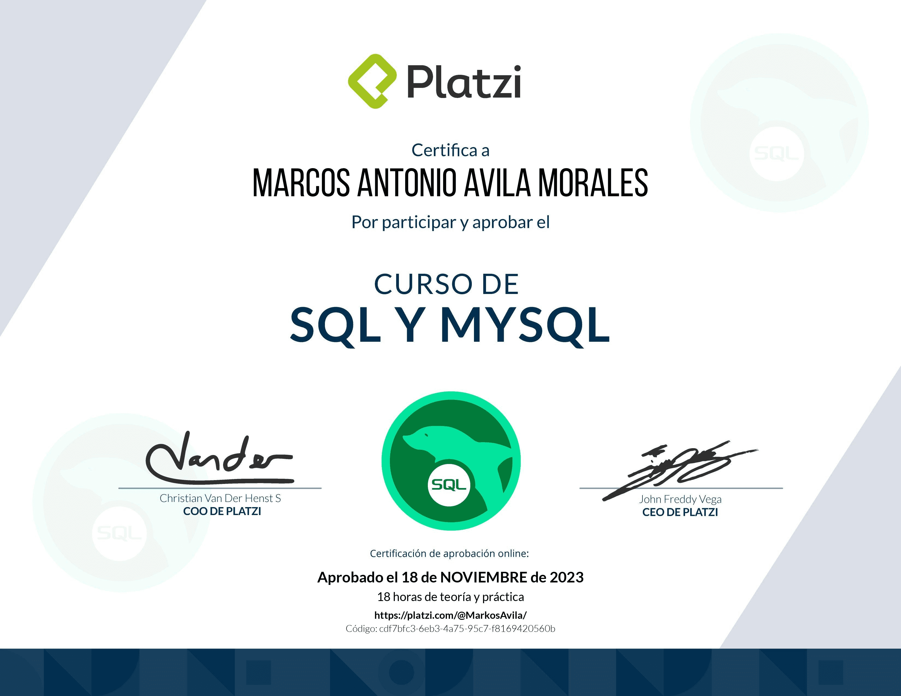
 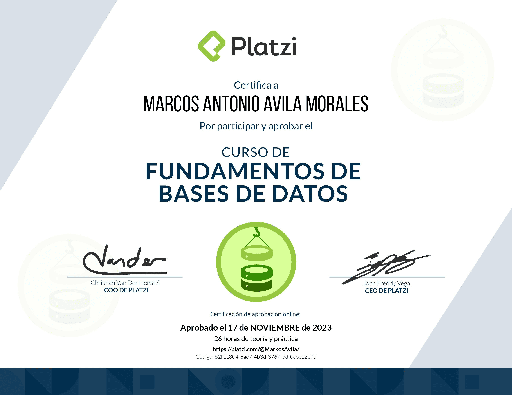
 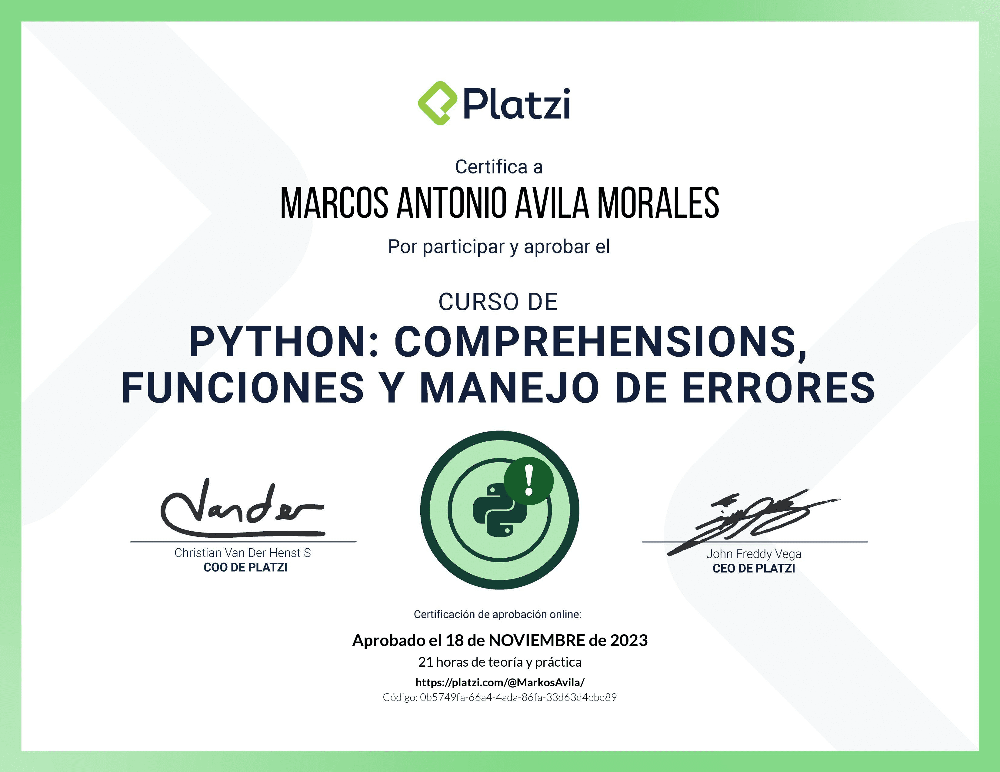
 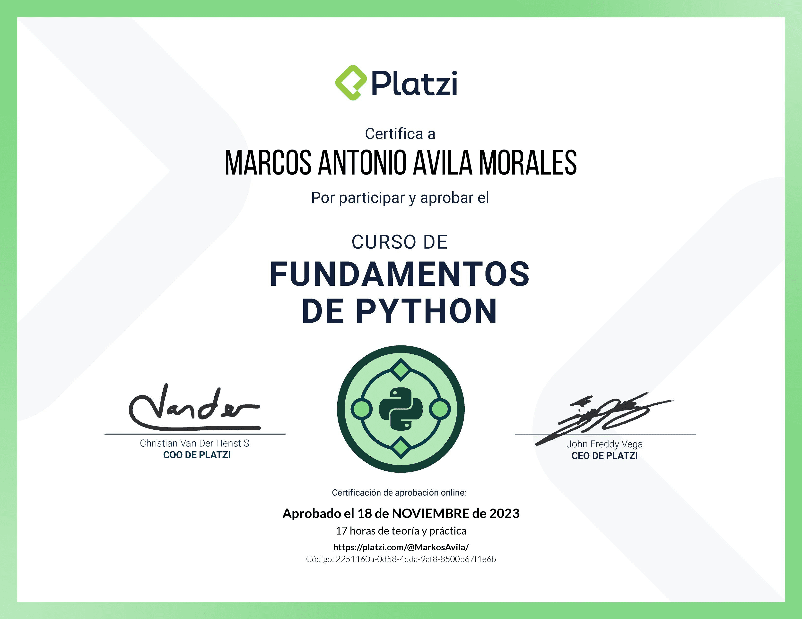
 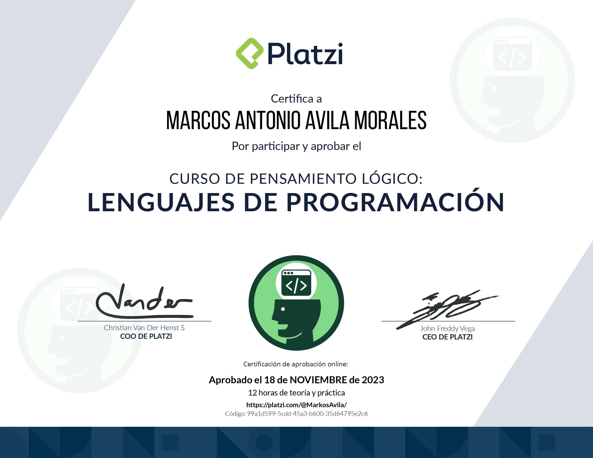
 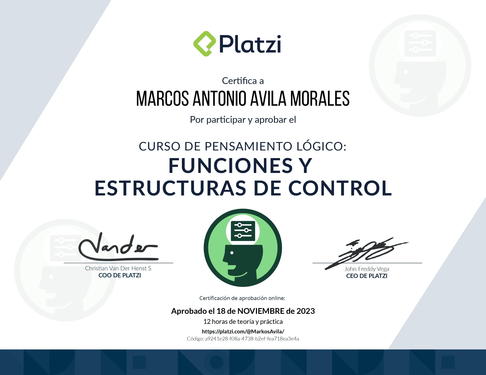
 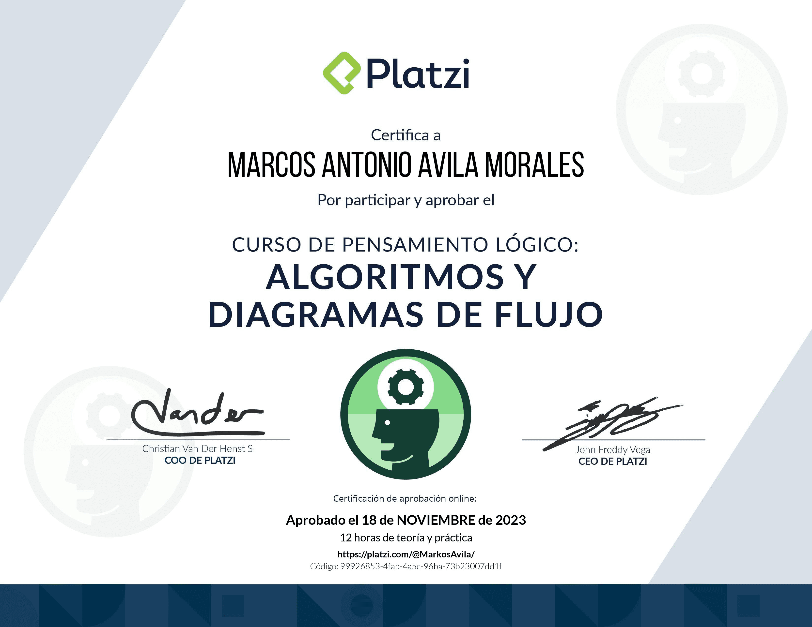
 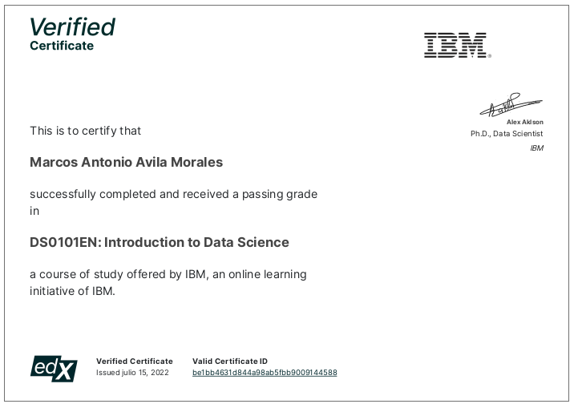
 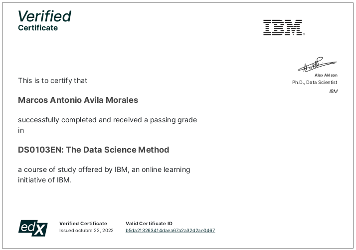
 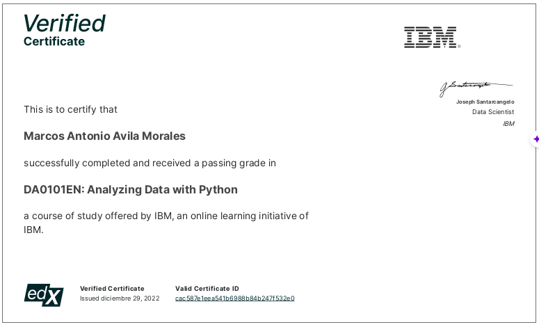
 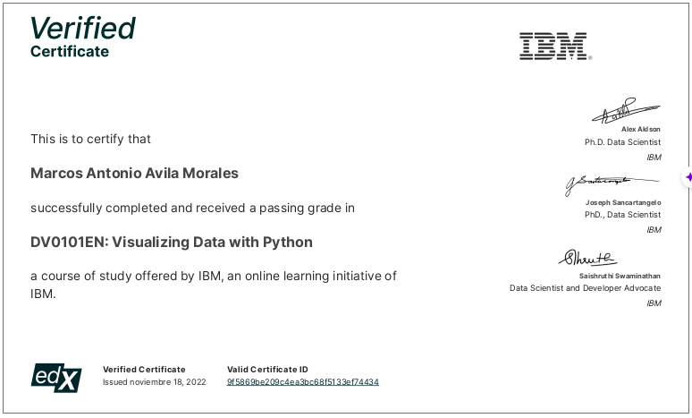
 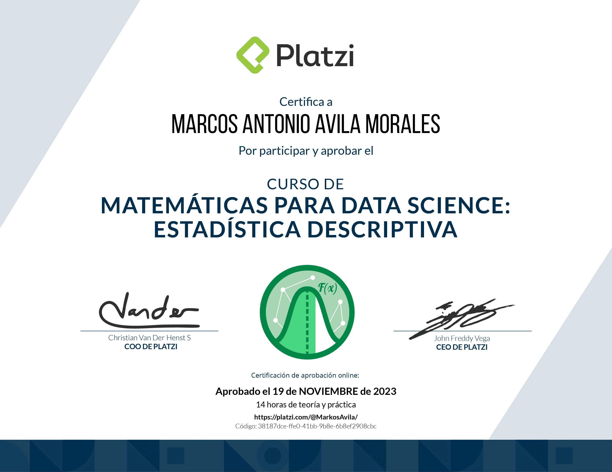

