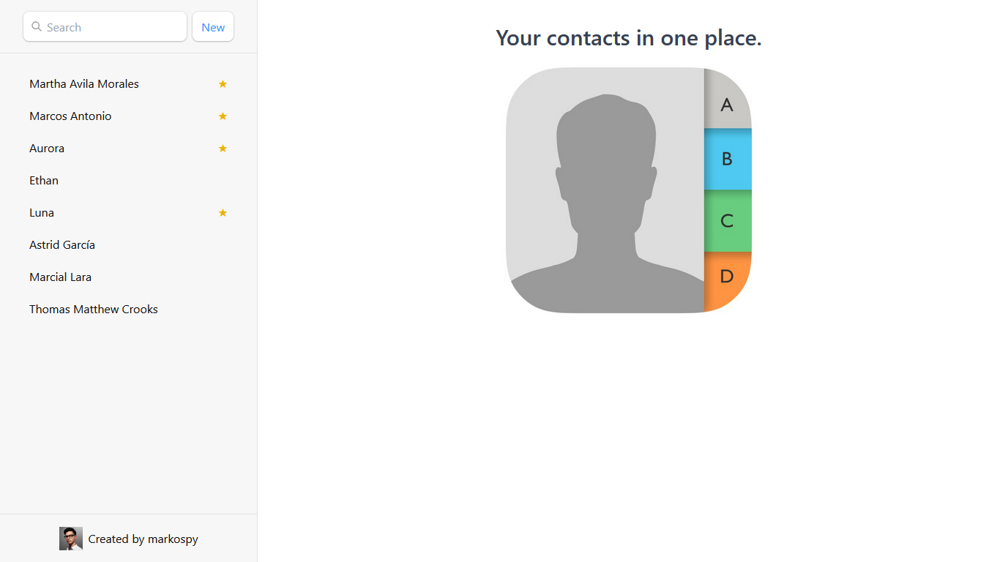
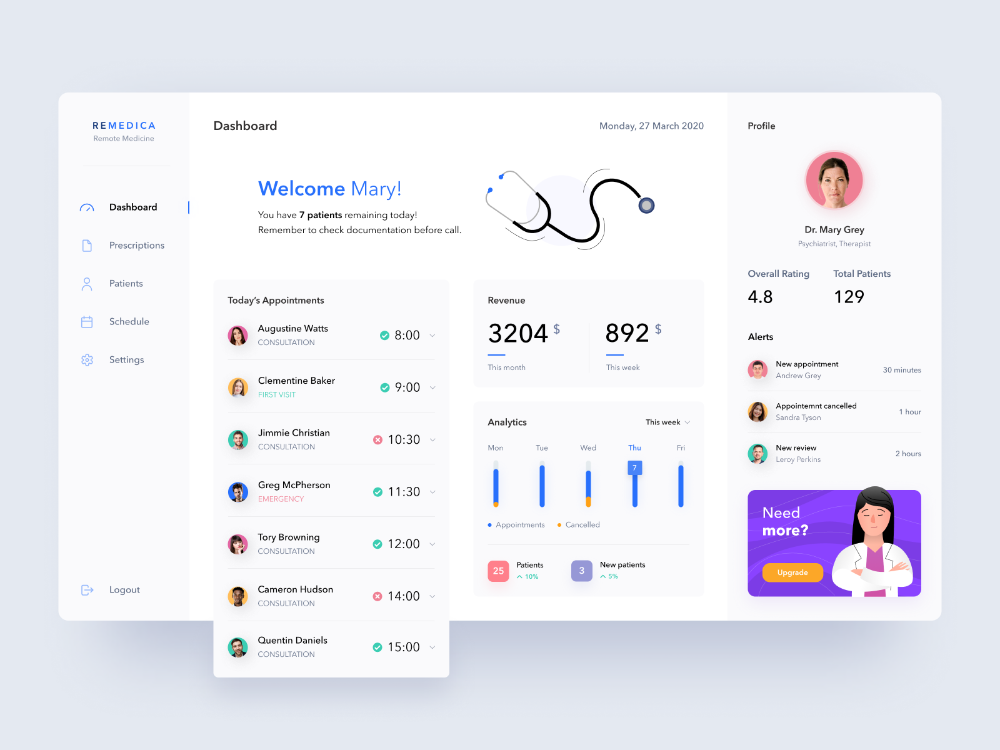

<body >
<h1 class="poppins-extrabold">About Me</h1>

I'm Marcos Antonio Avila Morales, a full-stack developer with a passion for web development, entrepreneurship and personal growth.

<h2 class="poppins-semibold">Skills</h2>

	<h3 class="poppins-medium">Frontend</h3>
	<ul class="poppins-regular">
		<li>✔️ HTML5</li>
		<li>✔️ CSS3</li>
		<li>✔️ JavaScript</li>
		<li>✔️ Typescript</li>
		<li>✔️ React</li>
		<li>✔️ Tailwind</li>
	</ul>

	<h3 class="poppins-medium">Backend</h3>
	<ul class="poppins-regular">
		<li>✔️ Python</li>
		<li>✔️ FastAPI</li>
		<li>✔️ Django</li>
	</ul>

	<h3 class="poppins-medium">Databases</h3>
	<ul class="poppins-regular">
		<li>✔️ SQL</li>
		<li>✔️ MySQL</li>
		<li>✔️ PostgreSQL</li>
		<li>✔️ MongoDB</li>
	</ul>

	<h3 class="poppins-medium">Tools</h3>
	<ul class="poppins-regular">
		<li>✔️ Git</li>
		<li>✔️ GitHub</li>
		<li>✔️ Linux</li>
		<li>✔️ Docker<li>
	</ul>

<h2 class="poppins-semibold">Projects</h2>

	

		<h3 class="poppins-medium project-h3"><a href='https://github.com/markospy/contacts' >Contact</a></h3>
		
		
Contact is a web application that allows users to create, read, update and delete contacts easily and efficiently. The application uses a microservices architecture, with a backend built with FastAPI and MongoDB, and a frontend built with React and various supporting libraries.

	

	

		<h3 class="poppins-medium project-h3"><a href='https://github.com/markospy/biodash' >BioDash</a></h3>
		
		
This backend serves to keep track of the patients' main cardiovascular and glycemic parameters. I am currently working on the frontend.

	

	

		<h3 class="poppins-medium project-h3"><a href='https://github.com/markospy/landing_bet_master' >Bet Master</a></h3>
		
		
Landing page I made for a client. Shows the profit history of a sports betting hipster.

	

<h2 class="poppins-semibold">Languages</h2>
<ul class='list poppins-regular'>
	<li>✔️ Spanish (native)</li>
	<li>✔️ English (A2)</li>
</ul>

<h2 class="poppins-semibold">Professional goals for 2024</h2>
<ul class='list poppins-regular'>
	<li>✔️ Develop projects</li>
	<li>✔️ Join a team that promotes professional growth</li>
</ul>

<h2 class="poppins-semibold">Contact</h2>

	<ul class="poppins-regular">
		<li><a href="https://www.linkedin.com/in/marcos-antonio-avila-morales/">LinkedIn</a></li>
		<li><a href="https://wa.me/5355417357">WhatsApp: +53 55417357</a></li>
		<li><a href="mailto:marco.developer@outlook.com">Email: marco.developer@outlook.com</a></li>
	</ul>
	
Let's collaborate on exciting Python projects!

<h2>Certifications</h2>
	<table class="poppins-regular" >
		<tr>
			<th>Certification</th>
			<th>Image</th>
		</tr>
		<tr>
			<td>Bases de datos modularización deploy</td>
			<td></td>
		</tr>
		<tr>
			<td>FastAPI</td>
			<td></td>
		</tr>
		<tr>
			<td>Terminal</td>
			<td></td>
		</tr>
		<tr>
			<td>SQL MySQL</td>
			<td></td>
		</tr>
		<tr>
			<td>Diploma BD</td>
			<td></td>
		</tr>
		<tr>
			<td>Python Avanzado</td>
			<td></td>
		</tr>
		<tr>
			<td>Fundamentos Python</td>
			<td></td>
		</tr>
		<tr>
			<td>Lenguajes de programación</td>
			<td></td>
		</tr>
		<tr>
			<td>Funciones estructuras control</td>
			<td></td>
		</tr>
		<tr>
			<td>Algoritmos diagrama de flujo</td>
			<td></td>
		</tr>
		<tr>
			<td>Introduction to data science</td>
			<td></td>
		</tr>
		<tr>
			<td>Data science method</td>
			<td></td>
		</tr>
		<tr>
			<td>Análizy data</td>
			<td></td>
		</tr>
		<tr>
			<td>Visualizing data</td>
			<td></td>
		</tr>
		<tr>
			<td>Matemáticas data science</td>
			<td></td>
		</tr>
	</table>
</body>

